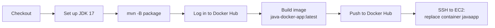

# Spring Boot on EC2 with GitHub Actions

A Spring Boot 3 (Java 17) web application that a single GitHub Actions workflow builds with Maven, packages as a Docker image, pushes to Docker Hub and deploys to an EC2 host over SSH.


<p>
  
  
  
</p>

## What this demonstrates

- One workflow carrying source through to a running container: build, image, registry, remote deploy
- Keeping registry and SSH credentials in repository secrets rather than in the workflow file
- Replacing a running container safely on each deploy

## Workflow

`.github/workflows/cicd.yml` runs on push:



On the EC2 host the workflow removes the old `javaapp` container, pulls the new image and starts it on port 8080.

> Pushing to this repository deploys it: each push runs the workflow and replaces the container on the EC2 host.

## Repository secrets

| Secret | Purpose |
|---|---|
| `DOCKERHUB_USERNAME` | Docker Hub account, also used as the image namespace |
| `DOCKERHUB_TOKEN` | Docker Hub access token |
| `EC2_HOST` | Public IP address or DNS name of the EC2 instance |
| `EC2_USER` | SSH user, for example `ubuntu` or `ec2-user` |
| `EC2_SSH_KEY` | Private key for that user |

The EC2 instance needs Docker installed, an SSH user allowed to run `docker`, and inbound port 8080 open in its security group.

## Run locally

```bash
mvn -B package
docker build -t java-docker-app .
docker run -p 8080:8080 java-docker-app
```

Open http://localhost:8080. Spring Boot Actuator is included, so `/actuator/health` reports the application's health.

## Repository structure

```text
.github/workflows/cicd.yml             Build, push and deploy workflow
src/main/java/com/example/App.java     Spring Boot application; serves the page at /
pom.xml                                Spring Boot parent, web and actuator starters, Java 17
Dockerfile                             eclipse-temurin:17-jdk runtime image
```

## Credits

The page served at `/` is course material from Learn With Kastro's GitHub Actions and Kubernetes masterclass.

---

<div align="center">
  <sub>Maintained by <a href="https://github.com/RajGenStack">Rajan Kumar</a> · <a href="https://www.linkedin.com/in/rajan-kumar42">LinkedIn</a></sub>
</div>
